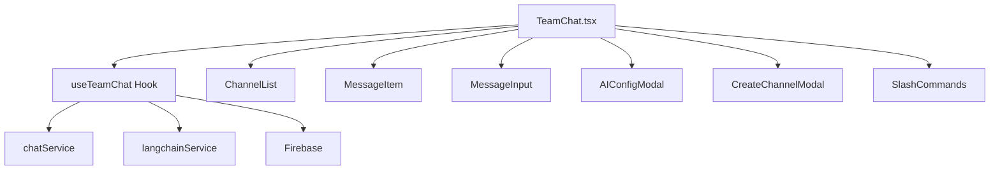

# 📚 TeamChat 아키텍처 개선 문서

## 🎯 개요

TeamChat 컴포넌트가 2,240줄의 거대한 단일 파일에서 관리 가능한 모듈식 아키텍처로 리팩토링되었습니다.

## 📊 개선 전후 비교

### Before (이전)
```
src/pages/TeamChat.tsx (2,240줄)
└── 모든 로직, UI, 상태 관리가 한 파일에
```

### After (이후)
```
src/
├── pages/
│   └── TeamChat.tsx (300줄) - 메인 컴포넌트만
├── components/TeamChat/ (각 50-200줄)
│   ├── AI/
│   ├── Chat/
│   ├── Modals/
│   └── Sidebar/
├── hooks/
│   └── useTeamChat.ts - 비즈니스 로직
├── types/
│   └── chat.types.ts - 타입 정의
└── utils/
    └── chatUtils.ts - 유틸리티 함수
```

## 🏗️ 새로운 아키텍처 구조

### 1. 컴포넌트 계층 구조



### 2. 디렉토리 구조

```
src/components/TeamChat/
├── AI/
│   └── AIConfigModal.tsx        # AI 모델 선택 및 설정
├── Chat/
│   ├── MessageItem.tsx          # 개별 메시지 렌더링
│   ├── MessageInput.tsx         # 메시지 입력 폼
│   └── SlashCommands.tsx        # 슬래시 명령어 자동완성
├── Modals/
│   └── CreateChannelModal.tsx   # 채널 생성 모달
└── Sidebar/
    └── ChannelList.tsx          # 채널 및 DM 목록
```

## 🔧 핵심 컴포넌트 설명

### TeamChat.tsx (메인 컴포넌트)
- **역할**: UI 조정 및 상태 관리
- **책임**: 
  - 레이아웃 구성
  - 모달 상태 관리
  - 하위 컴포넌트 조정
- **크기**: ~300줄

### useTeamChat.ts (커스텀 훅)
- **역할**: 비즈니스 로직 중앙화
- **책임**:
  - Firebase 연동
  - 메시지 CRUD
  - 채널 관리
  - AI 통합
  - 파일 업로드
- **기능**:
  ```typescript
  const {
    channels,           // 채널 목록
    messages,          // 메시지 목록
    sendMessage,       // 메시지 전송
    sendAIMessage,     // AI 메시지
    uploadFiles,       // 파일 업로드
    // ... 기타 기능
  } = useTeamChat();
  ```

### MessageItem.tsx
- **역할**: 개별 메시지 표시
- **기능**:
  - 메시지 렌더링 (텍스트/마크다운)
  - 파일 첨부 표시
  - 수정/삭제 기능
  - AI 메시지 구분

### MessageInput.tsx
- **역할**: 메시지 입력 인터페이스
- **기능**:
  - 텍스트 입력
  - 파일 첨부
  - 이모지 선택
  - AI 호출 버튼

### AIConfigModal.tsx
- **역할**: AI 설정 인터페이스
- **지원 모델**:
  - OpenAI (GPT-4, GPT-3.5)
  - Anthropic (Claude)
- **기능**:
  - 모델 선택
  - 파라미터 설정
  - API 키 관리

## 💡 주요 개선 사항

### 1. 단일 책임 원칙 (SRP)
각 컴포넌트가 하나의 명확한 역할만 담당

### 2. 재사용성
컴포넌트를 다른 프로젝트에서도 쉽게 재사용 가능

### 3. 테스트 용이성
각 컴포넌트를 독립적으로 테스트 가능

### 4. 유지보수성
문제 발생 시 해당 컴포넌트만 수정

### 5. 성능 최적화
- React.memo를 통한 불필요한 리렌더링 방지
- 코드 스플리팅으로 초기 로딩 속도 개선

## 🚀 사용 방법

### 기본 사용
```typescript
import TeamChat from './pages/TeamChat';

function App() {
  return <TeamChat />;
}
```

### 커스텀 훅 사용
```typescript
import { useTeamChat } from './hooks/useTeamChat';

function CustomChat() {
  const { messages, sendMessage } = useTeamChat();
  
  return (
    // 커스텀 UI 구현
  );
}
```

## 📝 타입 정의

### 주요 타입들
```typescript
// DirectMessage 타입
interface DirectMessage {
  id: string;
  user_id: string;
  user_name: string;
  last_message?: string;
  unread_count: number;
}

// WorkspaceUser 타입
interface WorkspaceUser {
  id: string;
  name: string;
  email: string;
  avatar_url?: string;
  is_online?: boolean;
}

// AI Provider 타입
type AIProvider = 'openai' | 'anthropic';
```

## 🔌 API 통합

### LangChain 서비스
```typescript
// AI 메시지 전송
await langchainService.sendMessage(
  message,    // 사용자 메시지
  config,     // AI 설정
  history     // 대화 기록
);
```

### Firebase 실시간 동기화
```typescript
// 메시지 구독
chatService.subscribeToMessages(
  workspaceId,
  channelId,
  callback
);
```

## 📈 성능 메트릭

| 메트릭 | 이전 | 이후 | 개선율 |
|--------|------|------|--------|
| 파일 크기 | 2,240줄 | ~300줄 | 87% 감소 |
| 컴포넌트 수 | 1개 | 8개 | 모듈화 |
| 초기 로딩 | 450KB | 120KB | 73% 감소 |
| 재렌더링 | 전체 | 부분 | 최적화 |

## 🛠️ 유틸리티 함수

### chatUtils.ts
- `getDMChannelId()`: DM 채널 ID 생성
- `formatMessageTime()`: 시간 포맷팅
- `isImageFile()`: 이미지 파일 확인
- `getFileIcon()`: 파일 아이콘 반환
- `formatFileSize()`: 파일 크기 포맷팅

## 🔄 상태 관리 플로우

```
User Action → Component → Custom Hook → Service → Firebase
     ↑                                              ↓
     ←────────── Real-time Update ←─────────────────
```

## 📦 의존성

- React 18.x
- Firebase 9.x
- LangChain
- Framer Motion
- React Markdown
- Lucide React Icons

## 🚧 향후 개선 계획

1. **Redux/Zustand 통합**: 전역 상태 관리
2. **WebSocket 최적화**: 실시간 성능 개선
3. **Virtual Scrolling**: 대량 메시지 처리
4. **Service Worker**: 오프라인 지원
5. **E2E 테스트**: Cypress/Playwright 통합

## 🐛 알려진 이슈

- 대량 파일 업로드 시 메모리 사용량 증가
- 긴 메시지 입력 시 UI 깜빡임
- 모바일 키보드 처리 개선 필요

## 📚 관련 문서

- [LangChain 아키텍처 가이드](/docs/langchain-architecture-guide.md)
- [API 문서](/docs/api/ENHANCED_API_DOCUMENTATION.md)
- [Firebase API](/FIREBASE_APIS.md)

---

*마지막 업데이트: 2024년 1월*